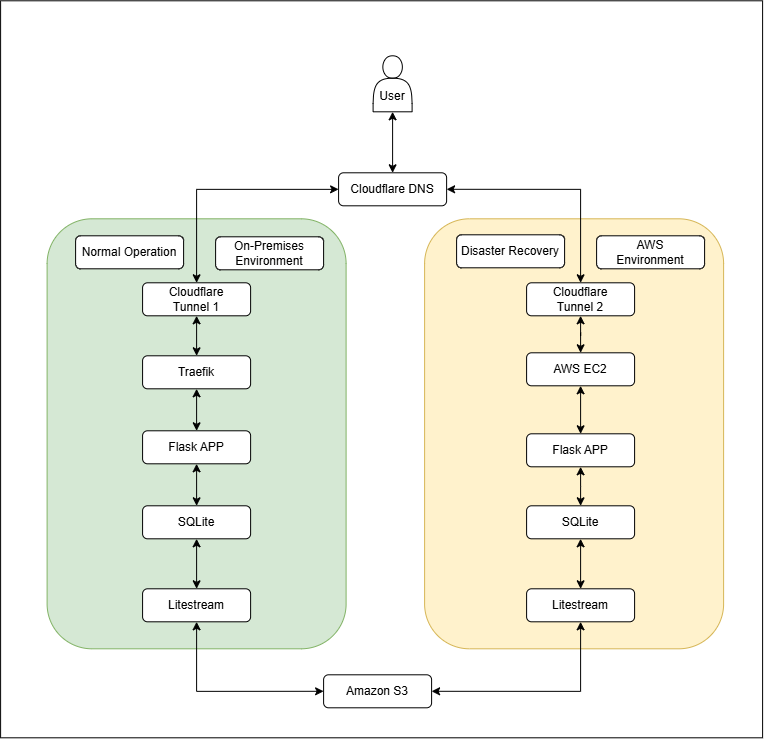

# Disaster Recovery — On-Premises to AWS

> 🌐 Languages: English | [Português (Brasil)](README.pt-BR.md)

## Overview

This project implements a practical **Disaster Recovery (DR)** strategy for a containerized application running in an on-premises environment, using AWS as the secondary recovery environment.

If the primary environment becomes unavailable, the Disaster Recovery infrastructure is provisioned on demand in AWS through Terraform. The recovery instance restores the latest available database version, starts the application in Docker containers, and, after integrity and health validations, traffic is redirected to the AWS environment.

After the on-premises environment is recovered, the failback process is executed: the latest data is restored to the primary environment, application integrity is validated, and traffic is redirected back to the original environment.

## Objectives

- Design a hybrid DR strategy;
- Automate infrastructure with Terraform;
- Replicate SQLite to S3;
- Execute failover and failback;
- Measure RTO/RPO;
- Apply security controls.

## Architecture

The solution uses two main environments:

### Primary Environment (On-Premises)

Responsible for normal application operation.

Main components:

- Linux Server;
- Docker;
- Flask application;
- SQLite database;
- Litestream;
- Traefik;
- Cloudflare Tunnel.

### Disaster Recovery Environment — AWS

Provisioned when required to take over application execution.

Main components:

- Amazon EC2;
- Amazon S3;
- AWS Identity and Access Management — IAM;
- AWS Systems Manager Session Manager;
- Docker;
- Flask application;
- SQLite;
- Litestream;
- Cloudflare Tunnel.



More details:
[Architecture](docs/en/architecture.md)

## Recovery Strategy

### Normal Operation

During normal operation, SQLite database changes are continuously replicated to Amazon S3 by Litestream. The data is stored in a versioned bucket.

On-premises → SQLite → Litestream → S3.

### Failover

Once an on-premises failure is confirmed, the Disaster Recovery infrastructure is provisioned in AWS through Terraform. During EC2 bootstrap, the required tools are installed, the database is restored from Amazon S3, the application healthcheck is executed, and finally the DNS record is transitioned to the new environment.

On-premises failure → AWS provisioning → restore → healthcheck → DNS transition.

### Failback

While the Disaster Recovery environment is active, all data written to the database is replicated to Amazon S3. After the on-premises environment is recovered, a playbook (`scripts/orchestrate-failback.sh`) executes the database restore from Amazon S3, database and application integrity validation, DNS transition, and AWS infrastructure deprovisioning.

DR → replication to S3 → on-premises restore → validation → DNS transition → AWS destroy.

More details:
[Implementation Plan](docs/en/implementation-plan.md)

## Recovery Objectives

| Metric | Target | Result |
|---|---:|---:|
| RTO | 10 min | 3 min 43 s |
| RPO | 1 min | Not measured |

> RPO was not measured in a controlled manner during this execution. The solution uses continuous and asynchronous SQLite replication to Amazon S3 through Litestream, so the expected RPO is low, but it was not empirically validated in this test.

## Security

Main controls:

- SSM Session Manager instead of public SSH;
- No application ports directly exposed;
- Cloudflare Tunnel;
- IAM Role for EC2;
- Non-root containers;
- Secrets kept outside the repository.

More details:
[Security](docs/en/security.md)

## Technologies

| Category | Technology |
|---|---|
| Cloud | AWS |
| IaC | Terraform |
| Compute | Amazon EC2 |
| Storage | Amazon S3 |
| Containers | Docker |
| Application | Flask |
| Database | SQLite |
| Replication | Litestream |
| Remote Management | AWS Systems Manager |
| Reverse Proxy | Traefik |
| External Access | Cloudflare Tunnel |

## Disaster Recovery Test

Validated flow:

1. On-premises application available;
2. Test record created;
3. Replication confirmed in S3;
4. On-premises environment made unavailable;
5. DR provisioned;
6. Database restored;
7. Integrity validated;
8. Application validated;
9. DNS redirected;
10. RTO recorded.

## Failback Test

1. New data created in DR;
2. Replication to S3;
3. Restore to on-premises;
4. Database validation;
5. Local healthcheck;
6. DNS returned;
7. AWS infrastructure removed.

## Evidence

Failover and failback test results are documented in:

[Lab Evidence](docs/evidence/README.md)

## Repository Structure

```text
disaster_recovery/
├── README.md
├── README.pt-BR.md
├── docker/
├── scripts/
├── terraform/
├── diagrams/
└── docs/
    ├── en/
    ├── pt-BR/
    └── evidence/
```
