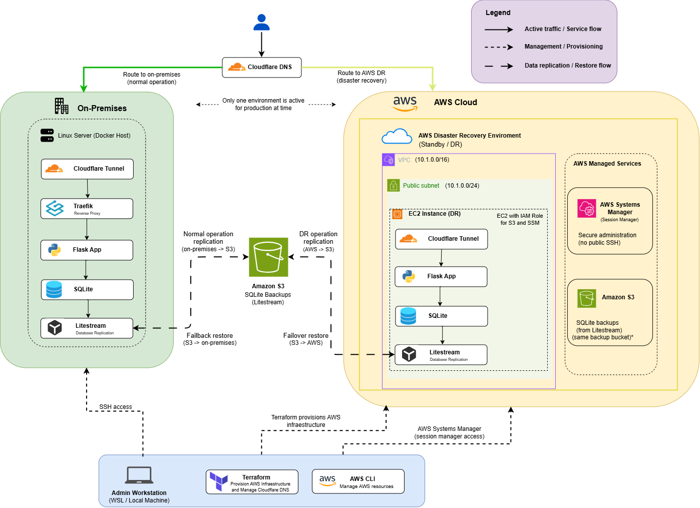

# Architecture

> 🌐 Languages: English | [Português (Brasil)](../pt-BR/architecture.md)

## 1. Overview

The solution implements a hybrid Disaster Recovery architecture between an
on-premises environment and AWS.

During normal operation, the application runs exclusively in the on-premises
environment. The SQLite database is continuously replicated to Amazon S3 through
Litestream.

If the primary environment becomes unavailable, the DR infrastructure is
provisioned on demand in AWS using Terraform. The database is restored from S3
and the application starts running on an Amazon EC2 instance.

After the primary environment is recovered, the data produced during the DR
period is restored to the on-premises environment and traffic is redirected
back to it.

The architecture uses an **active/passive** model, in which only one environment
serves application traffic at a time.

---

## 2. Architecture Diagram



The diagram represents the main infrastructure components, traffic flows,
replication paths, and administrative mechanisms used in the lab.

---

## 3. Components

### 3.1 On-Premises Environment

The primary environment consists of:

- Linux server running Docker;
- Flask application;
- SQLite database;
- Litestream;
- Traefik;
- Cloudflare Tunnel.

Traefik handles internal routing to the application, while Cloudflare Tunnel
publishes the service without directly exposing host ports to the Internet.

---

### 3.2 AWS Environment

The Disaster Recovery environment is provisioned on demand and uses:

- Amazon VPC;
- public subnet;
- Amazon EC2;
- Security Group;
- IAM Role / Instance Profile;
- AWS Systems Manager Session Manager;
- Amazon S3;
- Docker;
- Flask;
- SQLite;
- Litestream;
- Cloudflare Tunnel.

The EC2 instance does not use public SSH access. Administration is performed
through AWS Systems Manager.

Although the instance is placed in a public subnet, the application does not
have inbound ports exposed directly to the Internet. External access is
provided through Cloudflare Tunnel.

---

### 3.3 Amazon S3

Amazon S3 acts as the intermediate storage layer for SQLite database replicas.

During normal operation:

```text
On-Premises SQLite
        ↓
    Litestream
        ↓
    Amazon S3
```

During DR operation:

```text
AWS DR SQLite
      ↓
  Litestream
      ↓
  Amazon S3
```

The same storage is used as the source for restore operations during failover
and failback.

---

### 3.4 Cloudflare

Cloudflare is used for:

- DNS resolution;
- application publishing through Cloudflare Tunnel;
- routing traffic to the active environment.

DNS records are managed by Terraform through the Cloudflare Provider.

This allows the transition between environments to remain part of the declared
infrastructure state.

---

### 3.5 Administrative Workstation

The lab is managed from a Linux/WSL administrative workstation.

The workstation is responsible for:

- running Terraform;
- SSH access to the on-premises environment;
- access to EC2 through AWS Systems Manager;
- running orchestration scripts;
- managing failover and failback.

Simplified flow:

```text
Admin Workstation
      |
      +--- SSH ----------> On-Premises
      |
      +--- SSM ----------> AWS EC2
      |
      +--- Terraform ----> AWS
      |
      +--- Terraform ----> Cloudflare
```

---

## 4. Architecture Flows

### 4.1 Normal Operation

```text
User
 ↓
Cloudflare DNS
 ↓
Cloudflare Tunnel
 ↓
On-Premises
 ↓
Traefik
 ↓
Flask
 ↓
SQLite
 ↓
Litestream
 ↓
Amazon S3
```

The AWS compute environment does not need to remain active during this stage.

---

### 4.2 Failover

```text
On-Premises unavailable
        ↓
Terraform
        ↓
AWS DR provisioning
        ↓
Restore from S3
        ↓
Application validation
        ↓
DNS cutover
        ↓
AWS DR active
```

Traffic is only redirected to the DR environment after the application has been
restored and validated.

---

### 4.3 DR Operation

While the AWS environment remains active:

```text
User
 ↓
Cloudflare DNS
 ↓
Cloudflare Tunnel
 ↓
Amazon EC2
 ↓
Flask
 ↓
SQLite
 ↓
Litestream
 ↓
Amazon S3
```

Data produced during this period continues to be replicated to S3.

---

### 4.4 Failback

```text
AWS DR
 ↓
Final replication to S3
 ↓
Restore on-premises
 ↓
Database validation
 ↓
Application healthcheck
 ↓
DNS failback
 ↓
On-Premises active
 ↓
DR decommission
```

Before traffic is returned, both the database and application in the primary
environment are validated.

---

## 5. Architectural Decisions

### On-Demand DR

The Disaster Recovery compute environment does not remain active continuously.

**Motivation:** reduce costs.

**Trade-off:** provisioning increases RTO compared with a warm standby strategy.

---

### SQLite + Litestream + S3

Litestream enables an external copy of SQLite to be maintained without requiring
a permanently active secondary database server.

**Motivation:** simplicity and low cost.

**Trade-off:** replication is asynchronous, and the database must be restored
during the recovery process.

---

### Systems Manager Instead of Public SSH

The EC2 instance is administered using AWS Systems Manager Session Manager.

**Motivation:** avoid exposing TCP/22 and reduce the attack surface.

---

### Cloudflare Tunnel

The application is published without directly exposing ports on either the
on-premises environment or the EC2 instance.

**Motivation:** reduce the public attack surface of the infrastructure.

---

### Terraform as the Source of Truth

Terraform is used to provision AWS infrastructure and control DNS routing
through the Cloudflare Provider.

**Motivation:** make changes reproducible and reduce manual changes outside the
codebase.

---

## 6. Architecture Security

The main controls considered in the design are:

- no public SSH access to EC2;
- administrative access through SSM;
- Security Group with no direct application exposure;
- IAM Role associated with EC2;
- S3 access controlled through IAM permissions;
- containers running as non-root users;
- Cloudflare Tunnel for application publishing;
- secrets not stored in version-controlled code.

Control details are documented in: [Security](security.md)

## 7. Availability and Limitations

The solution provides recovery capability after loss of the primary environment,
but it does not implement High Availability.

Main limitations:

- a single EC2 instance in the DR environment;
- no Multi-AZ architecture;
- SQLite as the database;
- asynchronous replication;
- dependency on Amazon S3 for recovery;
- dependency on Cloudflare for publishing and DNS;
- dependency on the administrative workstation to start procedures;
- failover is not triggered automatically.

These limitations were accepted because of the lab's educational purpose and
low-cost focus.

## 8. Related Documents

- [Implementation Plan](implementation-plan.md)
- [Security](security.md)
- [Monitoring](monitoring.md)
- [Cost Analysis](cost-analysis.md)
- [Troubleshooting](troubleshooting.md)
- [Lessons Learned](lessons-learned.md)
- [Evidence](../evidence/README.md)
