# Test Evidence — Disaster Recovery

> 🌐 Languages: English | [Português (Brasil)](README.pt-BR.md)

This document records the evidence collected during the execution of the lab's Disaster Recovery and failback tests.

The images in this directory are shared between the Portuguese and English versions.

## 1. Objective

Record the technical evidence used to validate the Disaster Recovery strategy between the on-premises environment and AWS.

The evidence in this document is intended to demonstrate:

- normal application operation in the on-premises environment;
- SQLite database replication to Amazon S3;
- primary environment unavailability;
- DR environment provisioning;
- database restore;
- application availability in AWS;
- RTO measurement;
- data creation during DR operation;
- replication of that data to S3;
- restore to the on-premises environment;
- failback validation;
- traffic return to the primary environment;
- DR environment decommissioning.

---

## 2. Test Scope

### In scope

- failover from on-premises → AWS;
- SQLite database restore;
- integrity validation;
- application healthcheck;
- DNS routing change;
- temporary operation in the DR environment;
- failback from AWS → on-premises;
- data persistence validation;
- AWS infrastructure decommissioning.

### Out of scope

- Multi-AZ testing;
- High Availability;
- fully automated failover without intervention;
- load testing;
- performance testing;
- offensive security testing.

---

## 3. Test Environment

### Primary environment

- Linux Server
- Docker
- Flask
- SQLite
- Litestream
- Traefik
- Cloudflare Tunnel

### DR environment

- Amazon EC2
- Amazon S3
- AWS Systems Manager
- Docker
- Flask
- SQLite
- Litestream
- Cloudflare Tunnel

### Orchestration

- Terraform
- AWS CLI
- Bash
- SSH
- AWS Systems Manager Session Manager

---

## 4. Success Criteria

The test is considered successful when:

- the on-premises environment is stopped;
- the DR environment is provisioned;
- the database is restored;
- database integrity is validated;
- the application becomes available in AWS;
- DNS is redirected correctly;
- new data can be written in the DR environment;
- data produced in DR is replicated to S3;
- the database is restored to the on-premises environment;
- data created during DR is recovered;
- the on-premises application is healthy;
- DNS is returned to the primary environment;
- the DR environment can be removed.

---

## 5. Results Summary

| Test | Expected result | Observed result | Status | Evidence |
|---|---|---|---|---|
| On-premises application operational | Application accessible and validation record present before failure | Application available in the on-premises environment and test record created successfully | **Passed** | 01 |
| SQLite → S3 replication | Recent database replica available in Amazon S3 | Database replicas identified in S3 through the AWS Console and AWS CLI after a new record was created | **Passed** | 02–03 |
| Primary environment failure | On-premises application unavailable after stack shutdown | Stack stopped and public endpoint unavailable, returning HTTP 404 | **Passed** | 04 |
| DR provisioning | DR infrastructure successfully created by Terraform | `terraform plan` generated and `terraform apply` completed, provisioning the required DR resources | **Passed** | 05–07 |
| DR restore | Database restored from replicas stored in S3 | Application started in DR with data previously available in the on-premises environment | **Passed** | 08–09 |
| DR database integrity | Restored database intact and usable by the application | Application started and used the restored database; no specific `PRAGMA integrity_check` evidence was captured at this stage | **Passed with observation** | 08–09 |
| DR application | Application externally available through the AWS environment | Application became available in the DR environment and allowed access and write operations | **Passed** | 08–09 |
| RTO | Service restored within the defined target | Observed RTO of **223 s (3 min 43 s)** | **Passed** | 08 |
| Write during DR | New records created and persisted while DR is active | New records were created in the DR environment; additional evidence confirms on-premises stack inactive and DR running | **Passed** | 09, 11 |
| DR → S3 replication | Updated DR state replicated to S3 | New replicas were identified in the bucket after writes performed in the DR environment | **Passed** | 10 |
| On-premises restore | Latest database state restored to the primary environment | Restore completed successfully and pre-failback safety backup created | **Passed** | 12–13 |
| Failback validation | Database intact and DR-created data present after restore | `PRAGMA integrity_check` returned `ok` and the validation record created in DR was found in the restored database | **Passed** | 13 |
| On-premises healthcheck | Application healthy before returning traffic | Stack started and healthcheck completed successfully through Traefik | **Passed** | 14–15 |
| DNS failback | DNS changed to return traffic to the on-premises environment | Terraform applied the DNS change and state indicated `active_environment = "onprem"` | **Passed** | 16–17 |
| Public validation after failback | Public endpoint accessible again after return to on-premises | First attempt returned HTTP 502; a subsequent attempt completed successfully | **Passed with observation** | 18 |
| DR decommission | Temporary AWS resources removed after failback | Terraform removed the DR environment without affecting the already restored on-premises environment | **Passed** | 18–19 |

---

# 6. Failover Evidence

## 6.1 Normal Operation in the On-Premises Environment

### Objective

Demonstrate that the application was operational before the simulated failure.

### Expected result

- application accessible;
- database intact;
- test record present.

### Observed result

The application was available in the on-premises environment and responding normally before the simulated failure. A validation record was created in the SQLite database for later confirmation during the recovery process. This state was used as the initial reference for the Disaster Recovery test.

### Evidence

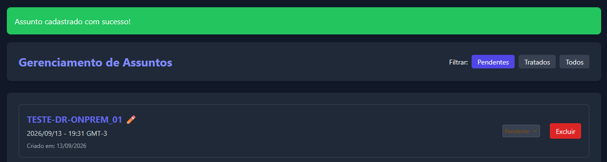

---

## 6.2 Database Replication to Amazon S3

### Objective

Confirm that Litestream is replicating SQLite to S3 before the disaster.

### Expected result

A recent replica exists in the configured bucket.

### Observed result

The presence of SQLite database replicas in the Amazon S3 bucket was confirmed through both the AWS Console and AWS CLI after a new record was created in the application.

The evidence shows that Litestream was correctly replicating database changes to the remote storage used by the Disaster Recovery process.

### Evidence

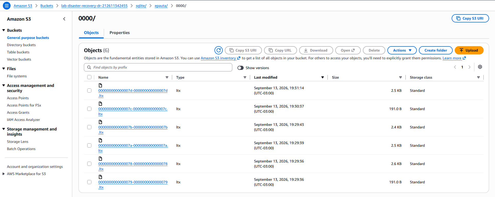

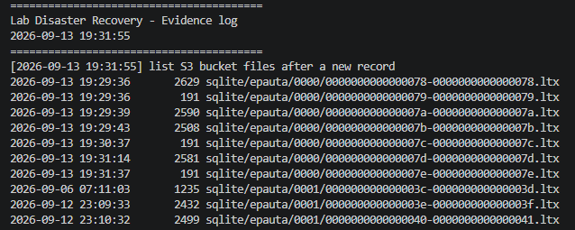

---

## 6.3 Failure Simulation

### Objective

Simulate primary environment unavailability.

### Action performed

The application stack in the on-premises environment was stopped, making the service unavailable to users.

### Expected result

The application should no longer respond externally.

### Observed result

After the stack was stopped, access to the application through the public endpoint stopped working and returned HTTP 404.

The unavailability confirmed the primary environment failure and marked the start of the recovery scenario.

### Evidence

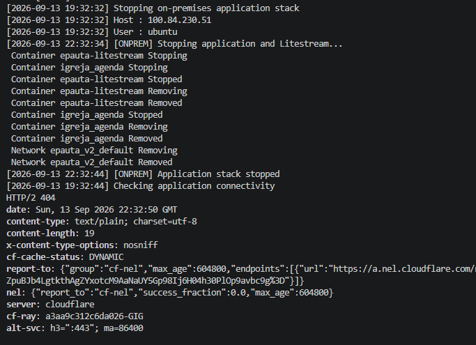

---

## 6.4 DR Environment Provisioning

### Objective

Create the AWS infrastructure required for recovery.

### Action performed

The Disaster Recovery infrastructure was provisioned using Terraform.

First, a plan was generated using the variable files for the DR environment:

```bash
terraform plan \
  -var-file=environments/dr.tfvars \
  -var-file=terraform.tfvars \
  -out=dr.tfplan
```

After reviewing the plan, the infrastructure was provisioned with:

`terraform apply dr.tfplan`

### Expected result

- infrastructure created;
- EC2 available;
- bootstrap started;
- restore executed;
- application prepared to receive traffic.

### Observed result

The `terraform plan` was successfully generated using the DR environment variable files, and `terraform apply` completed the provisioning of the required AWS resources.

After the plan was applied, the EC2 instance and supporting Disaster Recovery resources were created, allowing the process to continue to the restore and application validation stages.

### Evidence

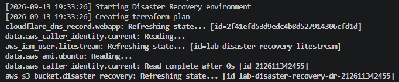

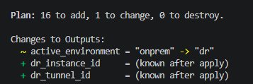

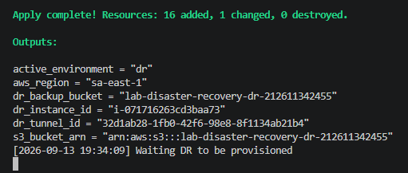

---

## 6.5 DR Application Validation

### Objective

Confirm that the application is operational after recovery.

### Expected result

- database restored;
- valid healthcheck;
- application externally available.

### Observed result

After the Disaster Recovery environment was provisioned, the application became externally available through the AWS environment.

It was confirmed that the restored database contained the expected data and that the application was functional, allowing the test to continue with temporary operation in the DR environment.

### Evidence

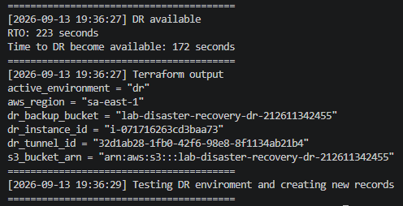

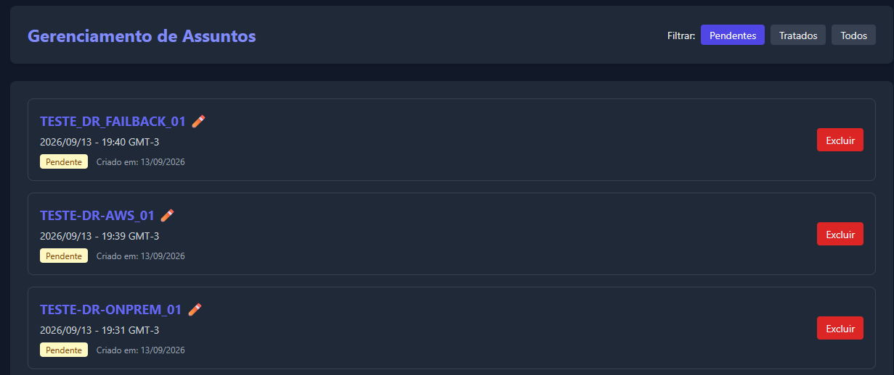

---

## 7. RTO Measurement

### 7.1 Definition

For this execution, RTO was defined as the interval between completion of the application stack shutdown in the on-premises environment and the first automatic confirmation that the application was available through the DR environment.

The measurement was performed automatically by the evidence script using in-memory timestamps during execution:

```bash
DISASTER_TIME=$(date +%s)
...
END=$(date +%s)

echo "RTO: $((END - DISASTER_TIME)) seconds"
```

---

### 7.2 Result

| Metric | Result |
|---|---:|
| Observed RTO | **223 seconds (3 min 43 s)** |
| DR activation time | **172 seconds (2 min 52 s)** |

The RTO of 223 seconds (3 min 43 s) was calculated automatically by the script during execution.

Although the complete output was not persisted to a log file, the timestamps captured in the screenshots showing the start of the outage and DR availability are consistent with the calculated value.

---

### 7.3 Notes

The following factors influenced the observed RTO:

- **Manual pauses for evidence collection:** the workflow included a manual interruption before DR environment provisioning, increasing the total measured time.
- **Healthcheck polling interval:** DR availability was checked at 5-second intervals, which may add a few seconds between actual application availability and detection by the script.
- **Execution of `terraform plan`:** the time required to generate the plan before `terraform apply` was also included in the observed RTO.

### 7.4 Evidence


---

## 8. Operation in the DR Environment

### 8.1 Creation of New Data

#### Objective

Demonstrate that the application operates normally while running in DR.

#### Action performed

Create a new record while the application is running in AWS.

#### Expected result

- new records are created and persisted in the DR SQLite database;
- the on-premises environment remains without the application stack running;
- the DR environment remains active and serving the application;
- data created during this period remains available for subsequent Amazon S3 replication and failback validation.

#### Observed result

During Disaster Recovery operation, new records were successfully created in the application.

The collected evidence simultaneously shows the on-premises environment without an active stack and the DR environment with its containers running, confirming that AWS was the environment serving the application at that time.

The new records were persisted in the DR SQLite database and later used to validate replication to Amazon S3 and the failback process.

#### Evidence


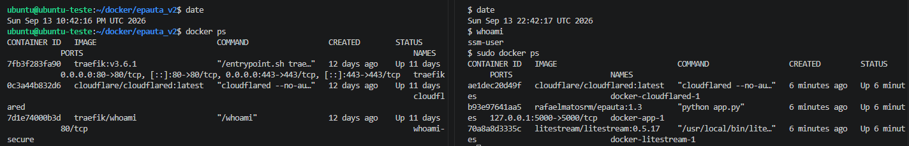

---

### 8.2 Replication During DR

#### Objective

Confirm that data produced in AWS was replicated to S3.

#### Expected result

Updated replica containing the state produced during DR.

#### Observed result

During operation in the Disaster Recovery environment, the SQLite database replicas in Amazon S3 were confirmed to have been updated after new records were created in the application.

The evidence shows that Litestream continued replicating changes generated in the DR environment to remote storage, preserving the latest database state for subsequent use during failback.

#### Evidence

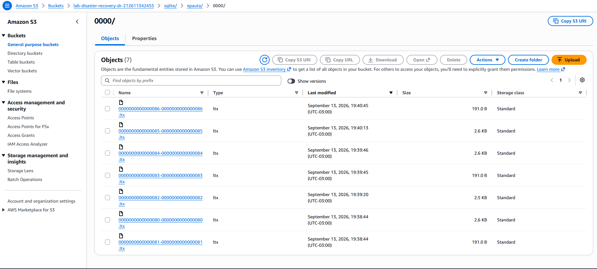

---

## 9. Failback Evidence

### 9.1 Failback Start

#### Objective

Start the controlled return process to the primary environment.

#### Expected result

The process should correctly identify the DR environment and start the failback sequence.

#### Observed result

The failback process was started from the administrative workstation using the orchestration script.

The execution confirmed the start of the sequence to return to the on-premises environment, coordinating interactions between the DR environment, the on-premises server, and Terraform.

From this point, the workflow continued with final data replication, database restoration in the primary environment, integrity validations, and the subsequent return of traffic to on-premises.

#### Evidence

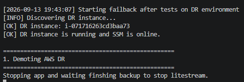

---

### 9.2 Restore to the On-Premises Environment

#### Objective

Restore the latest database from S3.

#### Expected result

- pre-failback backup created;
- restore completed;
- database intact.

#### Observed result

The latest database was restored to the on-premises environment from the replicas stored in Amazon S3.

Before replacing the local database, a pre-failback safety copy was created. The restore then completed successfully, allowing the process to continue with integrity validation, verification of records created during DR operation, and application startup in the primary environment.

#### Evidence

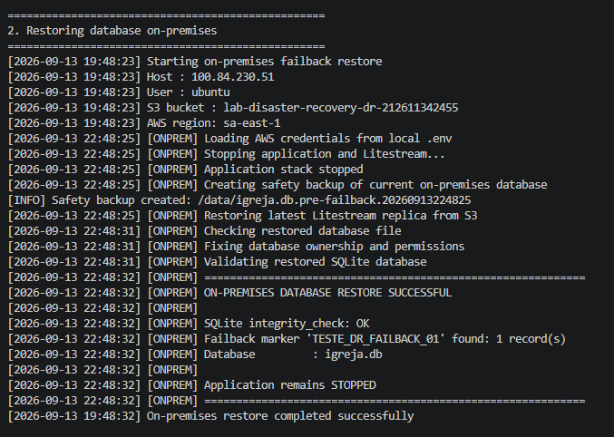

---

### 9.3 Restored Database Validation

#### Objective

Demonstrate that the restored database contains the data produced during DR.

#### Integrity validation

`PRAGMA integrity_check;`

Expected result:

`ok`

#### Validation record

`TESTE_DR_FAILBACK_01`

#### Observed result

After the restore to the on-premises environment, the SQLite database was successfully validated.

The integrity check returned `ok` through the `PRAGMA integrity_check` command, and the validation record created during DR operation was found in the restored database.

These results confirmed that the recovered database was intact and contained the data produced while the application was operating in AWS, allowing the failback process to continue.

#### Evidence


---

### 9.4 On-Premises Environment Healthcheck

#### Objective

Validate the application before returning public traffic.

#### Expected result

- containers running;
- application healthy;
- Traefik responding correctly.

#### Observed result

After the database restore and on-premises stack startup, the application healthcheck completed successfully.

The validation confirmed that the containers were running and that the application responded correctly through Traefik in the primary environment, allowing failback to continue before the DNS routing change.

With the on-premises environment validated as healthy, the process moved to the traffic return stage.

#### Evidence

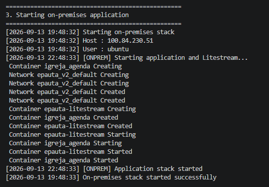

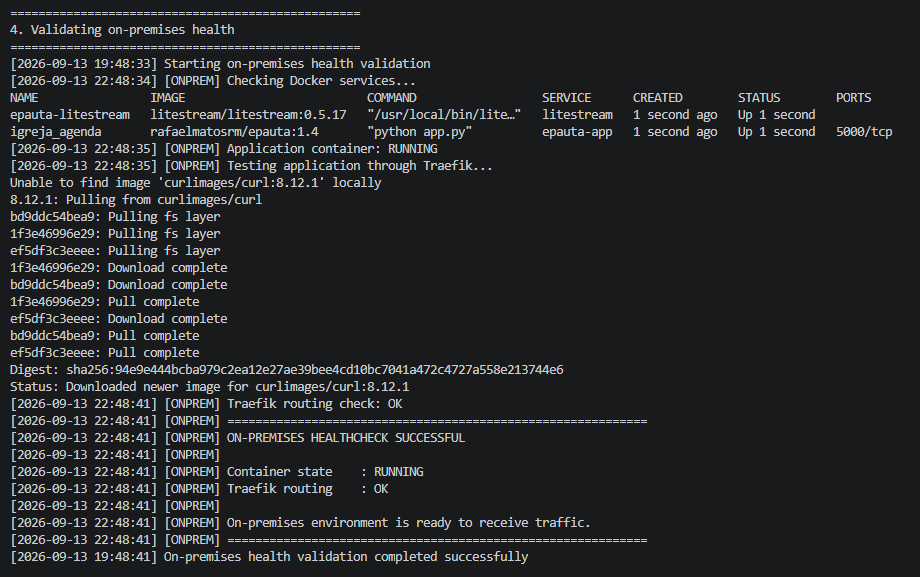

---

### 9.5 DNS Failback

#### Objective

Return traffic to the primary environment.

#### Expected result

Terraform should change the desired DNS state so that it points again to the on-premises Cloudflare Tunnel.

#### Observed result

After validating the on-premises environment, Terraform was executed to change the DNS routing and return traffic to the primary environment.

The change was successfully applied through the Cloudflare provider, and the desired state changed to indicate the on-premises environment as active.

After the transition was completed, the workflow continued with public application validation and subsequent decommissioning of the Disaster Recovery environment.

#### Evidence

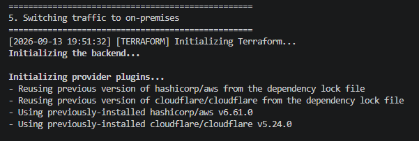

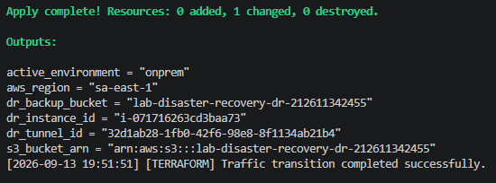

---

### 9.6 External Validation

#### Objective

Confirm that the application is again served by the on-premises environment.

#### Expected result

Application externally available after the DNS transition.

#### Observed result

After DNS was changed to the on-premises environment, the public endpoint was validated again.

The first attempt returned HTTP 502; a subsequent attempt completed successfully, confirming restoration of public access after the transition.

#### Evidence

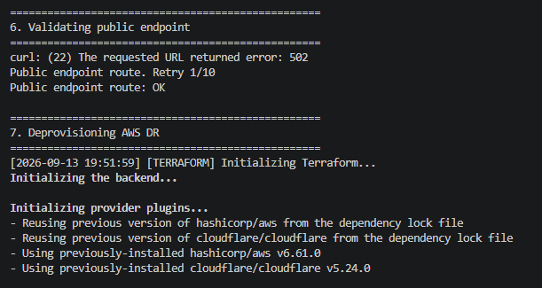

---

### 9.7 DR Environment Decommissioning

#### Objective

Remove temporary AWS resources after failback.

#### Expected result

- EC2 removed;
- temporary resources removed;
- primary environment remains operational.

#### Observed result

After validating the application's return to the on-premises environment, the Disaster Recovery environment in AWS was decommissioned.

Terraform removed the temporary resources used during the recovery process, closing the DR cycle without impacting the already restored primary environment.

At the end of this stage, the application remained operational on-premises and the temporary Disaster Recovery infrastructure was no longer active in AWS.

#### Evidence

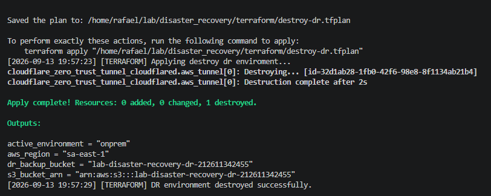

----

## 10. Final Result

### Failover

**Status: Passed**

The failover test was completed successfully.

After the on-premises environment was interrupted, the Disaster Recovery infrastructure was provisioned in AWS using Terraform. The SQLite database was recovered from the replicas stored in Amazon S3, and the application became available again through the DR environment.

The observed RTO was **223 seconds (3 min 43 s)**, with **172 seconds (2 min 52 s)** corresponding to the interval between the start of `terraform apply` and application availability in the DR environment.

The application remained functional while operating in AWS, and new data was written and subsequently replicated to Amazon S3.

### Failback

**Status: Passed**

The failback test was completed successfully.

Data produced while operating in the DR environment was replicated to Amazon S3 and subsequently restored to the on-premises environment.

After the restore:

- database integrity was validated;
- the record created during DR was recovered;
- the on-premises application was started;
- the local healthcheck passed;
- DNS was changed to return traffic to the primary environment;
- public access was validated;
- the DR environment was decommissioned.

### Overall Result

**Status: Passed**

The lab successfully demonstrated the complete Disaster Recovery cycle:

```text
On-Premises
     ↓
Replication to S3
     ↓
Failure
     ↓
AWS Provisioning
     ↓
Restore
     ↓
Failover
     ↓
DR Operation
     ↓
Replication to S3
     ↓
Failback
     ↓
On-Premises
     ↓
DR Decommission
```

## 11. Test Notes and Limitations

The execution was performed in a lab environment and included manual steps for evidence collection.

The main limitations observed were:

- the process depends on an external administrative workstation to run the scripts and Terraform;
- manual pauses were introduced during failover to collect evidence;
- DR availability was checked by polling at 5-second intervals;
- the infrastructure uses a single EC2 instance and does not implement Multi-AZ;
- failover is not triggered automatically after failure detection;
- metrics and timestamps were displayed in the terminal but were not persisted to a log file during this execution.

## 12. Conclusion

The execution successfully validated the complete Disaster Recovery cycle proposed for the lab.

After the on-premises environment became unavailable, the application was recovered in AWS with an observed RTO of **3 min 43 s**. During operation in the DR environment, new data was generated and replicated to Amazon S3.

The failback process restored this data to the on-premises environment, validated database integrity and application health before traffic was returned. After external validation, the temporary DR resources were decommissioned.

No loss of the validation records used as markers during the failover and failback tests was observed.

The test therefore demonstrated the viability of the proposed on-demand recovery strategy using Terraform, Amazon EC2, Amazon S3, Litestream, Docker, and Cloudflare.
